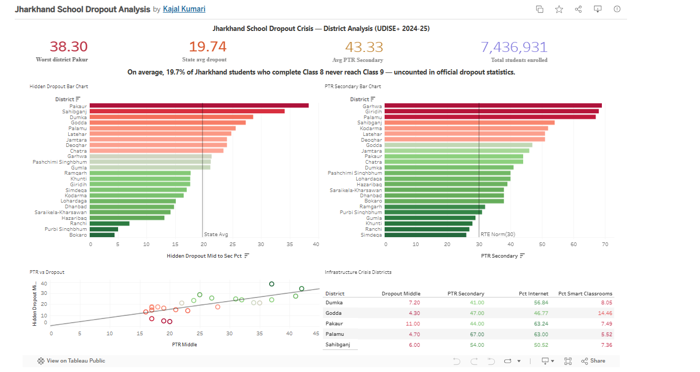

# Jharkhand School Dropout Analysis
### A District-Level Data Analysis | UDISE+ 2024-25

**by Kajal Kumari** | Assistant System Engineer, TCS | NSS Volunteer 2021–23

---

## Overview

This project analyses school dropout patterns across all 24 districts of Jharkhand using official UDISE+ 2024-25 data. It was motivated by my personal experience as an NSS volunteer teacher in a government school in Chennai, where I witnessed first-hand why children stop attending school — and wanted to quantify that problem at scale.

The central finding: **Jharkhand's official dropout statistics significantly undercount the true crisis.** While reported dropout rates appear modest, transition rate data reveals that on average **19.74% of students who complete Class 8 never reach Class 9** — silently disappearing from the education system without being counted.

---

## Research Questions

1. Which districts in Jharkhand have the highest school dropout rates?
2. What structural factors — teacher shortage, infrastructure — drive dropout?
3. Which districts need the most urgent policy intervention?

---

## Key Findings

| Finding | Value |
|---------|-------|
| State average hidden dropout (Class 8→9) | **19.74%** |
| Worst district — Pakaur | **38.30% hidden dropout** |
| Average PTR at Secondary level | **43.33** (RTE norm: 30) |
| Strongest predictor of dropout | **PTR at Middle level (r = 0.75)** |
| Total students enrolled (Jharkhand) | **74,36,931** |

**What actually drives dropout:**
- PTR at Middle level: r = +0.75 (strongest predictor)
- School quality (PGI Score): r = −0.72 (better schools = fewer dropouts)
- Smart classroom availability: r = −0.60
- Tribal (ST) proportion: r = +0.03 (almost zero — not the real cause)

---
## Budget Allocation Model


A data-driven budget allocation framework that determines optimal 
distribution of education funding across all 24 Jharkhand districts 
to maximise dropout reduction.

**Model outputs:**
- District priority ranking (Crisis Score 60% + Efficiency Score 40%)
- Budget allocation for any total spend (₹100–1000 crore)
- Teacher hiring cost estimates per district
- Smart classroom investment requirements
- Estimated students retained per crore invested

---

## Dashboard

**Live interactive dashboard (Tableau Public):**
> https://public.tableau.com/app/profile/kajal.kumari6766/viz/JharkhandSchoolDropoutAnalysis/Dashboard2?publish=yes


---

## Project Structure

```
jharkhand-dropout-analysis/
├── data/
│   ├── jharkhand_master_data.csv        ← already uploaded
│   └── jharkhand_budget_allocation.csv  ← add this now
├── scripts/
│   ├── extract_udise_data.py            ← already uploaded
│   └── budget_allocation_model.py       ← add this now
├── notebooks/
│   └── jharkhand_eda.ipynb              ← already uploaded
├── charts/
│   ├── chart1_district_rankings.png     ← already uploaded
│   ├── chart2_correlations.png          ← already uploaded
│   ├── chart3_infrastructure_heatmap.png ← already uploaded
│   └── chart4_budget_allocation.png     ← add this now
├── dashboard/
│   ├── dashboard_screenshot.png         ← save screenshot of dropout dashboard
│   └── budget_model_screenshot.png      ← save screenshot of budget model
└── README.md
```

---

## Data Sources

| Dataset | Source | Used for |
|---------|--------|----------|
| UDISE+ 2024-25 District Fact Sheets | [udiseplus.gov.in](https://udiseplus.gov.in) | All 37 indicators across 24 districts |
| Jharkhand State Fact Sheet | [udiseplus.gov.in](https://udiseplus.gov.in) | State-level benchmarks |

---

## Tools Used

- **Python** (Pandas, Matplotlib, Seaborn, pdfplumber) — data extraction and EDA
- **Tableau Public** — interactive dashboard
- **UDISE+ Portal** — primary data source

---

## Policy Recommendations

Based on the data analysis:

1. **Priority teacher hiring** in Pakaur, Sahibganj, Garhwa, Giridih, and Palamu — these districts have the highest PTR and worst dropout outcomes.
2. **Smart classroom expansion** in the 5 crisis districts — infrastructure investment correlates strongly with student retention (r = −0.60).
3. **Transition monitoring reform** — track the Class 8→9 transition rate, not just annual dropout rates. The current metric misses nearly 1 in 5 students lost.

---

## Personal Connection

During my NSS volunteer service (2021–23) at a government school in Chennai, I taught English, Science, and Computer Science to students who faced many of the barriers this data reveals — irregular attendance, overworked teachers, and limited infrastructure. This project is my attempt to move from anecdote to evidence, and from evidence to a policy recommendation for my home state.

---

## Author

**Kajal Kumari**
- Assistant System Engineer, Tata Consultancy Services
- B.C.A., Stella Maris College, Chennai (CGPA: 8.4)
- NSS Volunteer, 2021–23
- [LinkedIn](https://www.linkedin.com/in/kajalkumari29)
- kumari.kajal29003@gmail.com
